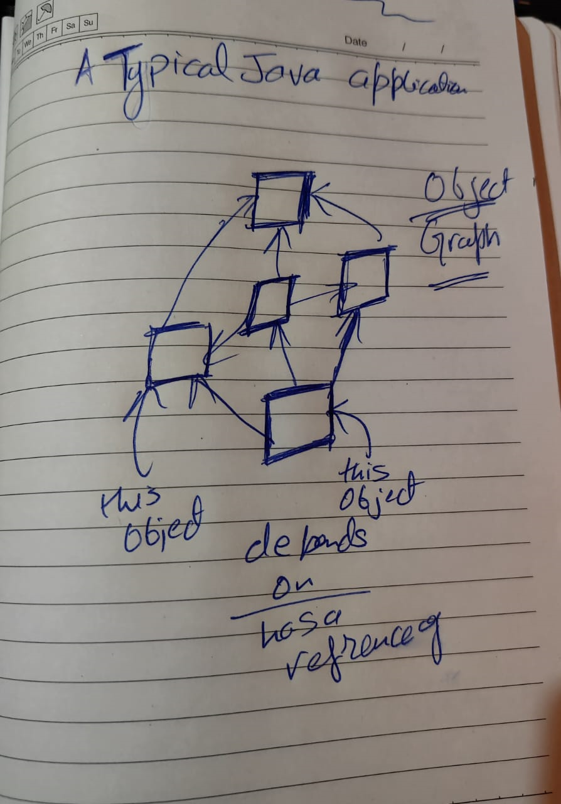

basically spring is kind of wrapper over this whole object graph and  it tells us that it need instances of A, B, c , d classes etc and Spring wrapper provide those classes

Spring Wrapper here is called `spring application context` 

Basically spring gives provides following things.
	1. spring context and dependency injection to manage dependency better way
	2. provide Data access api to java
	3. either website are Dynamic web project or rest api so here Spring MVC helps us to create project.

> Spring Basically remove tight coupling by applying dependency injection

