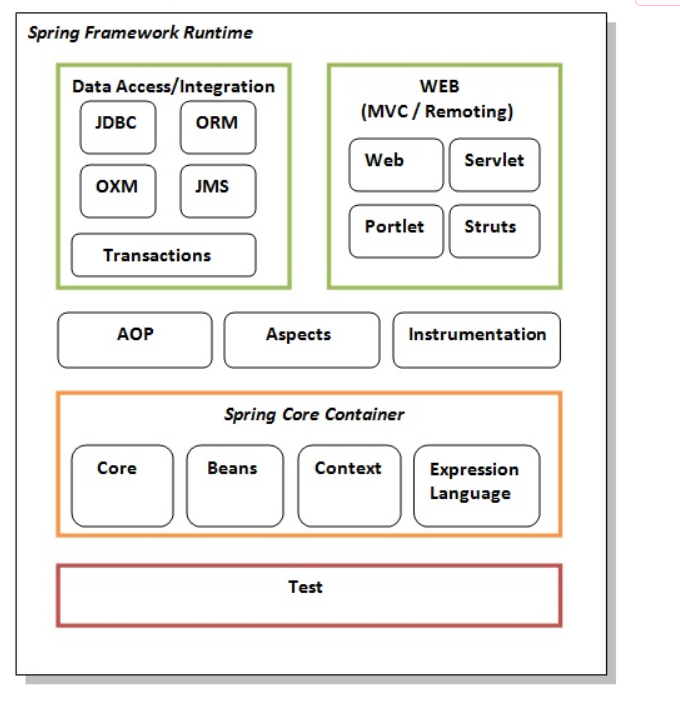

1. **Spring Core**: everything basic component is here. Dependency injection, IOC. Core and Beans have DI and IOC. 
- context inherit many feature from Bean module JEE and JMS are also provided by this. 
- Object can be manipulated run time by expression language.
2. **AOP** :- Aspect oriented programming it help us to define method interceptors and point cuts so we can decouple our code. and write better clean code.
3. **Data Access/Integration** :- JDBC abstraction layer, ORM is used to integrate, JMS provide integration layer to use Hibernate and jdbc. 
4.  **WEB Project** : to  use fileuploading rest api everything like servlet etc is for this.
5. **TEST**: module for Junit and TestNG for testing also provide MOCK Object to test things isolately.

>For Web development:
               Core, Web , Data Access.

